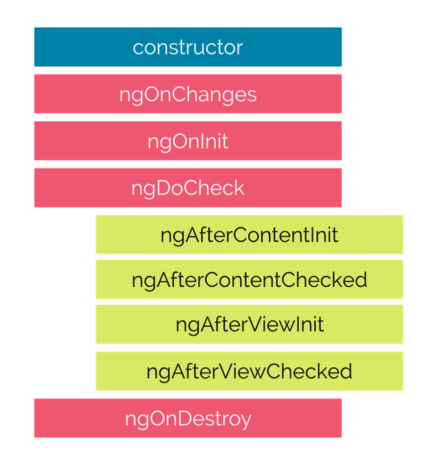
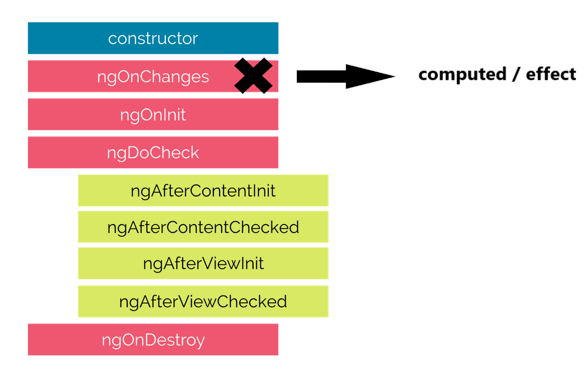
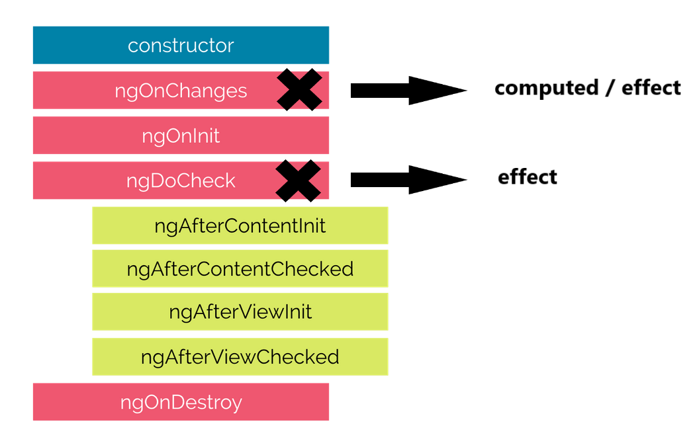
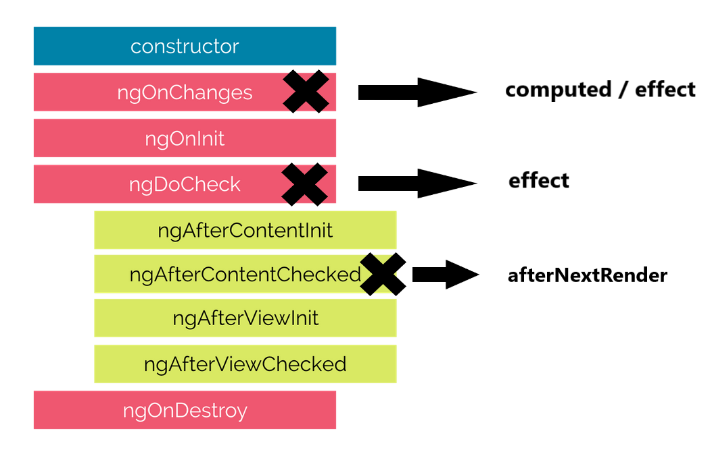
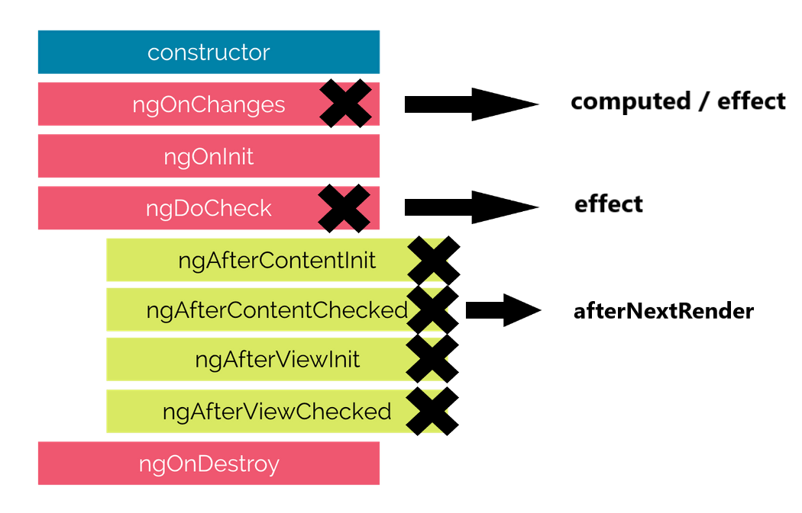
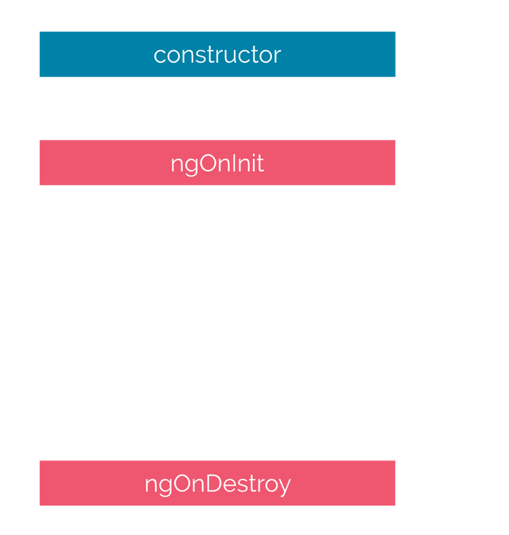

# Nouveaux lifecycles !

- `afterNextRender`
- `afterRender`
- `afterRenderEffect`

Notes:

- executé seulement côté browser => utile pour server side rendering / prerendering

- `afterNextRender` est appelé après le prochain render (oneshot)

  - utile pour init une lib externe

- `afterRender` est appelé après chaque render (pareil que `afterNextRender` mais pas oneshot)

- `afterRenderEffect` est un `effect` special qui est appelé au même moment que `afterRender`

##==##

<!-- .slide: class="with-code max-height" -->

# Nouveaux lifecycles !

```typescript [6-8]
@Component(...)
export class MyChartCmp {
  chartRef = viewChild<ElementRef>('chart');
  chart: MyChart | null;

  constructor() {
    afterNextRender(() => {
      this.chart = new MyChart(this.chartRef().nativeElement);
    });
  }
}
```

<!-- .element: class="big-code block" -->

Notes:

- nouveaux lifecycles peuvent être utilisées à peu près partout (services...)
  - pas d'interface à implémenter
  - ce sont des fonctions à qui il faut donner un callback

##==##

# Et les anciens lifecycles ?

<div class="full-center fragment">
 
</div>

Notes:

- Demander au public quels sont les 8 lifecycles existants

##==##

# Et les anciens lifecycles ?

<div class="full-center">
 
</div>

Notes:

##==##

# Et les anciens lifecycles ?

<div class="full-center">
 
</div>

Notes:

##==##

# Et les anciens lifecycles ?

<div class="full-center">
 
</div>

Notes:

##==##

# Et les anciens lifecycles ?

<div class="full-center">
 
</div>

Notes:

##==##

# Et les anciens lifecycles ?

<div class="full-center">
 
</div>

Notes:

- le lifecycle actuel d'Angular est fortement couplé à la détection de changement. En changeant de modèle de détection, plus de sens à garder les anciens cycles
